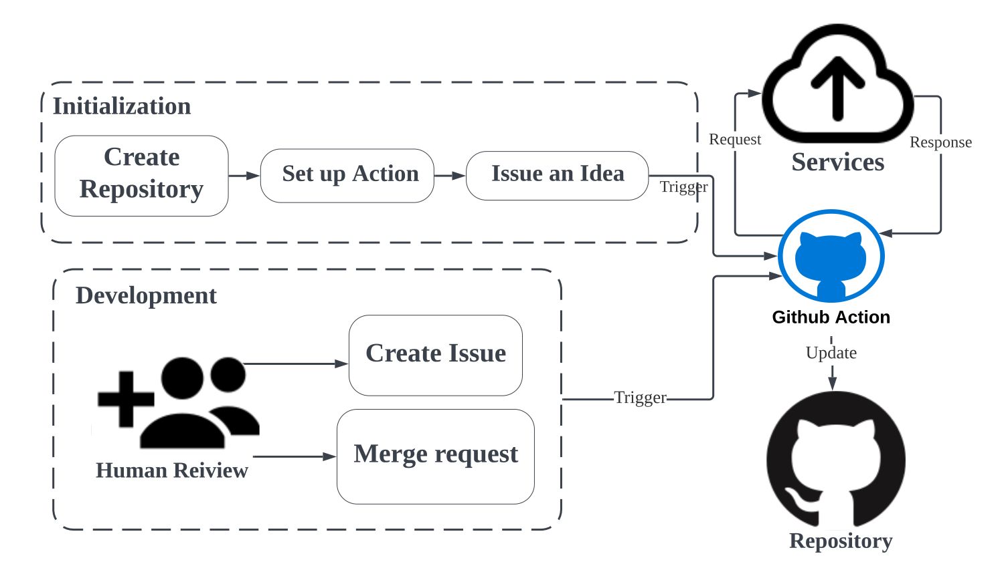
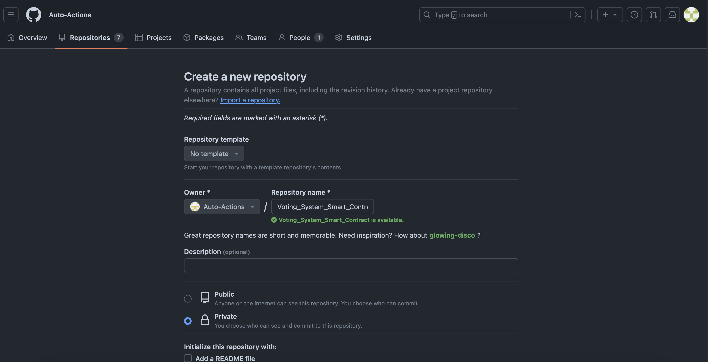
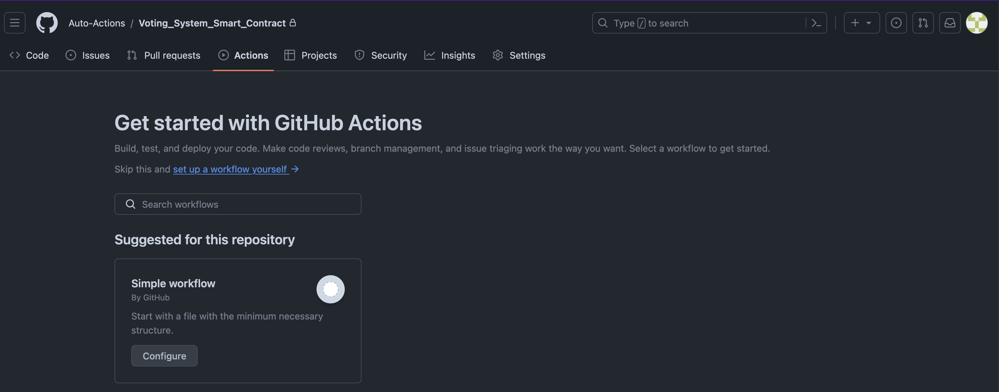
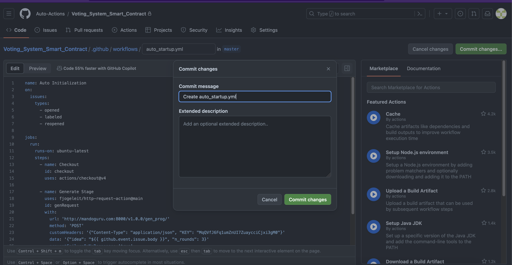
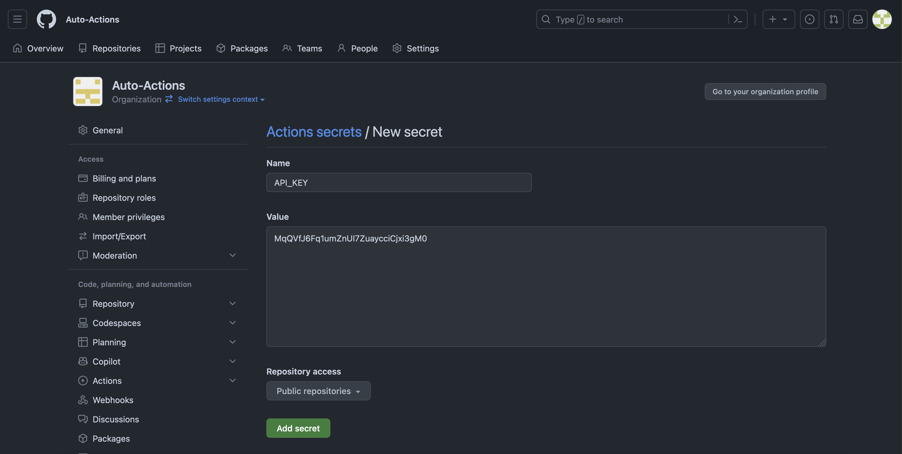
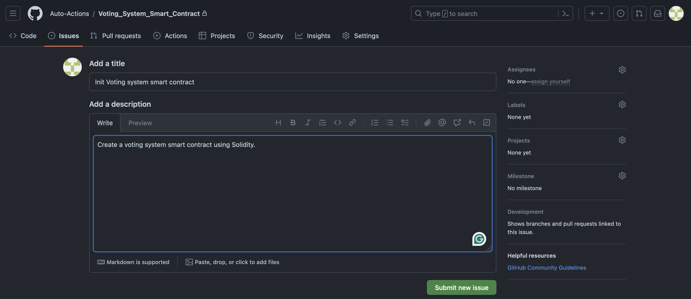
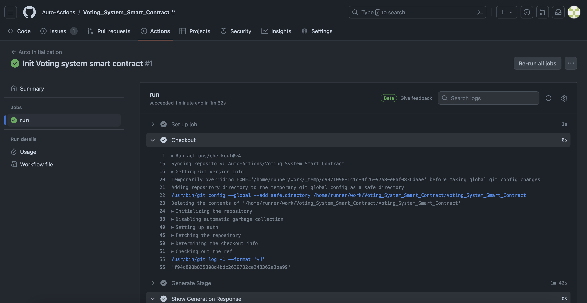

# Auto startup workspace
<p>
    <a href="https://www.python.org/" target="blank_"></a>
    <a href="https://fastapi.tiangolo.com/" target="blank_"></a>
    <a href="https://reactjs.org/" target="blank_"></a>
    <a href="https://opensource.org/licenses/MIT" target="blank_"></a>
</p>
<br/>

# Overview


The workspace allows developers to start up a project easily by creating an issue within your requirements.

# Usage

- When you come up with an idea then want to implement a software for that idea. Let's start by creating a new repository in our workspace.


- From the homepage of the new repository, switch to Action tab to manually set action through `set up a workflow yourself →`





## Action Workflow

- This is a simple version of action script.

```yaml
name: Auto Initialization
on:
  issues:
    types:
      - opened
      - labeled
      - reopened
      - edited

jobs:
  run:
    runs-on: ubuntu-latest
    steps:
      - name: Checkout
        id: checkout
        uses: actions/checkout@v4
        
      - name: Generate Stage
        uses: fjogeleit/http-request-action@main
        id: genRequest
        with:
          url: 'http://mandoguru.com:8000/v1.0.0/gen_prog/'
          method: 'POST'
          customHeaders: '{"Content-Type": "application/json", "KEY": "MqQVfJ6Fq1umZnUI7ZuaycciCjxi3gM0"}'
          data: '{"idea": "${{ github.event.issue.body }}", "n_rounds": 5, "project_name": "$ {{ github.repository }}"}'
          preventFailureOnNoResponse: 'true'
          timeout: 1000000
          
      - name: Show Generation Response
        run: echo ${{ fromJson(steps.genRequest.outputs.response).repo_name }}

      - name: Push Project
        uses: fjogeleit/http-request-action@main
        id: initRequest
        with:
          url: 'http://mandoguru.com:8000/v1.0.0/init_repo/'
          method: 'POST'
          customHeaders: '{"Content-Type": "application/json", "KEY": "MqQVfJ6Fq1umZnUI7ZuaycciCjxi3gM0"}'
          data: '{"id": "01", "name": "${{ fromJson(steps.genRequest.outputs.response).repo_name }}", "local": "${{ fromJson(steps.genRequest.outputs.response).repo_name }}", "remote_url": "${{ github.server_url }}/${{ github.repository }}", "remote_name": "origin", "branch": "initial", "commit_message": "Init commit"}'
          preventFailureOnNoResponse: 'true'
          timeout: 600000
```

- Commit the file as an initial commit. For further actions, you have to update this file as a new commit.

## Secure workflow



  - There is some sensitive information in the action script such as API key. It can be hidden by setting `API_KEY` secret variable in `Settings -> Secretes and variables -> Actions New repository secret`

    

  - Then replace the api key in the action script by:
  
    ```yaml
            customHeaders: '{"Content-Type": "application/json", "KEY": &{{ secret.API_KEY }}}'
    ```

- Next step is to tell the action about your idea by creating a new issue.


## Initial issues



- Then you can switch to Action tab to monitor the development process.



- When the action running finishes, the initial software is already in branch `initial`.


# Demo video


# TODO

## Service
- [ ] Tracking local repository on server for further update.
- [ ] Serve the feedback/review of developor from action.
- [ ] Agent for particular task such as summarize code, create readme files.
 
## Git Action
- [ ] Trigger action call reprogramming service when developer comment/create issue/merge request.
- [ ] Improve the customization of action. Avoid hardcode, allow developer modify request parameters by environment variables.


