# Auto startup workspace
<p>
    <a href="https://www.python.org/" target="blank_"></a>
    <a href="https://fastapi.tiangolo.com/" target="blank_"></a>
    <a href="https://reactjs.org/" target="blank_"></a>
    <a href="https://opensource.org/licenses/MIT" target="blank_"></a>
</p>
<br/>

# Overview
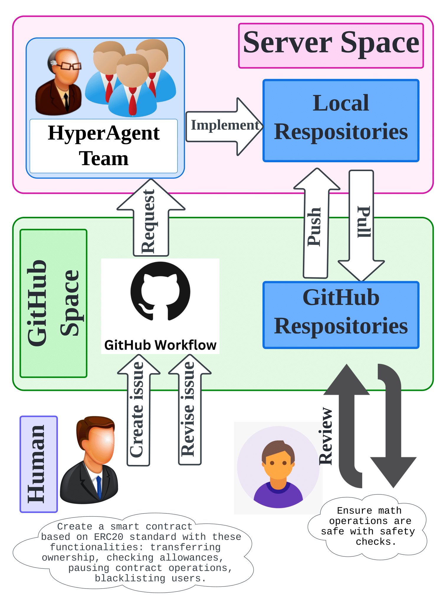

The workspace allows developers to start up a project easily by creating an issue within your requirements.

# Usage

## Setup repository

- When you come up with an idea then want to implement a software for that idea. Let's start by creating a new repository in our workspace.
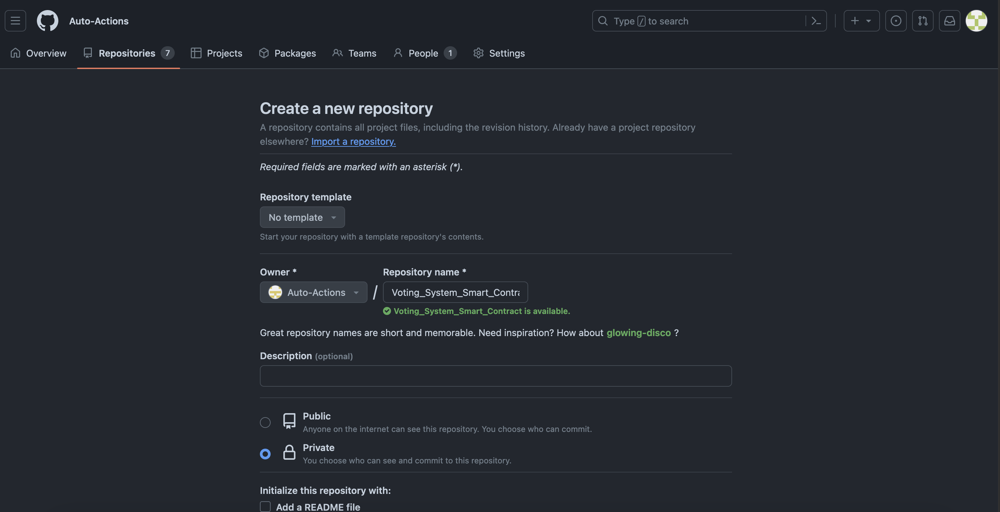

- Create GitHub Access Tokens
  - Go to `Settings ⟶ Developer Settings ⟶ Personal access tokens ⟶ Generate new token`
  - Select `All repositories` option in `Repository access`.
  - Grant `Read and Write` permission for `Contents` access.
  - Gerate token and copy to clipboard.
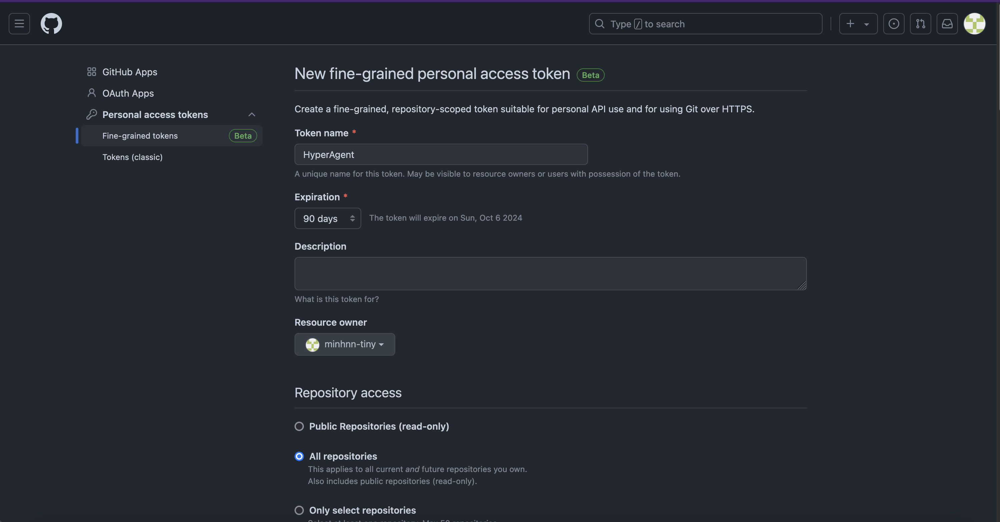

- Assign Secret
  - Grant repo token permission to access the repository.
    - From homepage of the created repository. Go to `Settings ⟶ Secrets and variables ⟶ Actions ⟶ New repository secret.
    - Name of the secrets is `ACTION_TOKEN`
    - Paste the created GitHub Access Tokens.
    - Add secret.
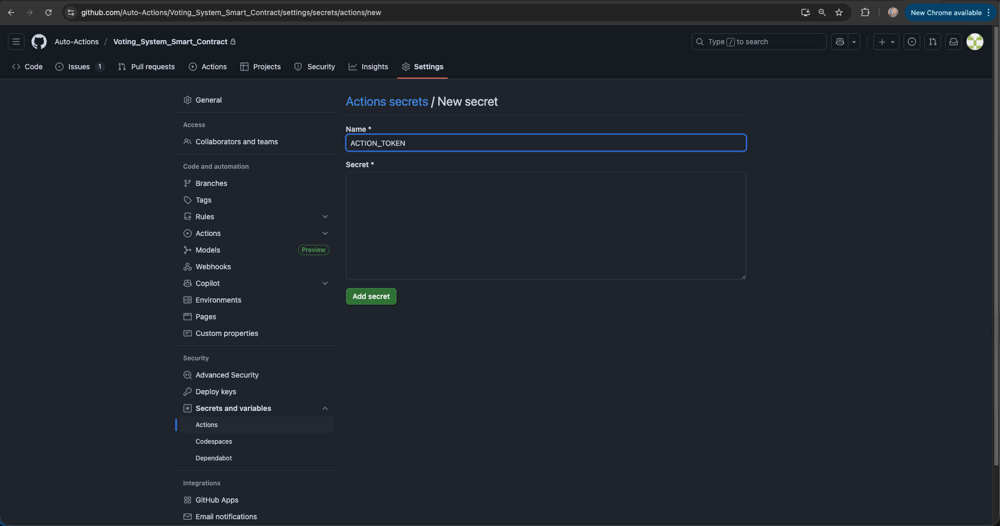
  - Add Gemini API key as secret variable.
    - Name of the secrets is `GEMINI_API_KEY`
    - Paste the created Gemini API key.
    - Add secret.
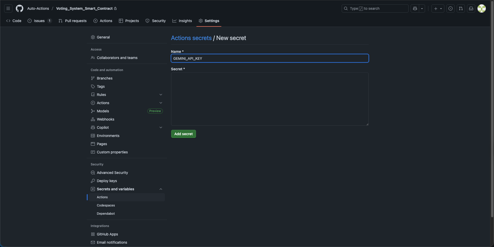


## Action Workflow

- From the homepage of the new repository, switch to Action tab to manually set action through `set up a workflow yourself →`


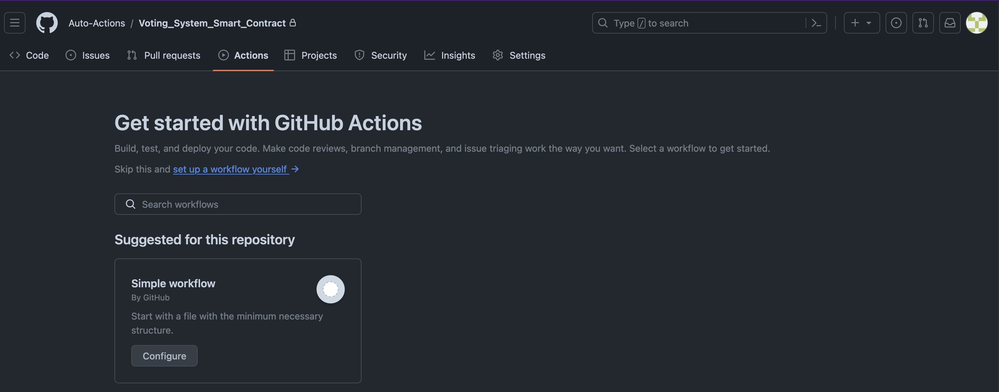


- This is a simple version of action script.

```yaml
name: Generate Code from Issue

on:
  issues:
    types: [opened, reopened, edited]

jobs:
  generate-code:
    runs-on: ubuntu-latest
    steps:
    - name: Checkout repository
      uses: actions/checkout@v4
      with:
        token: ${{ secrets.ACTION_TOKEN }}
        
    - name: HyperAgent Generator
      uses: Auto-Actions/hyperagent-action@master
      with:
        gemini-api-key: ${{ secrets.GEMINI_API_KEY }}
        github-token: ${{ secrets.ACTION_TOKEN }}
        output-path: 'generated-code'
        programming-language: 'python'
        branch-name: 'feature/ai-generated'
        create-pull-request: 'true'
        model-name: 'gemini-2.5-pro'
```

- Commit the file as an initial commit. For further actions, you have to update this file as a new commit.

<!-- ## Secure workflow

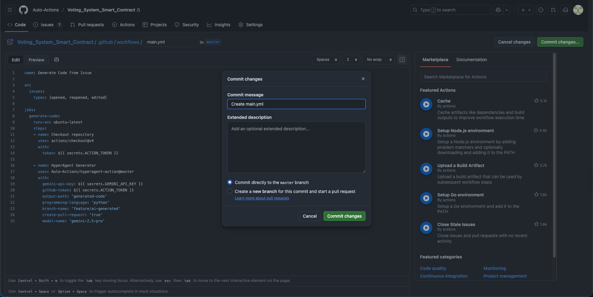

  - There is some sensitive information in the action script such as API key. It can be hidden by setting `API_KEY` secret variable in `Settings -> Secretes and variables -> Actions New repository secret`

    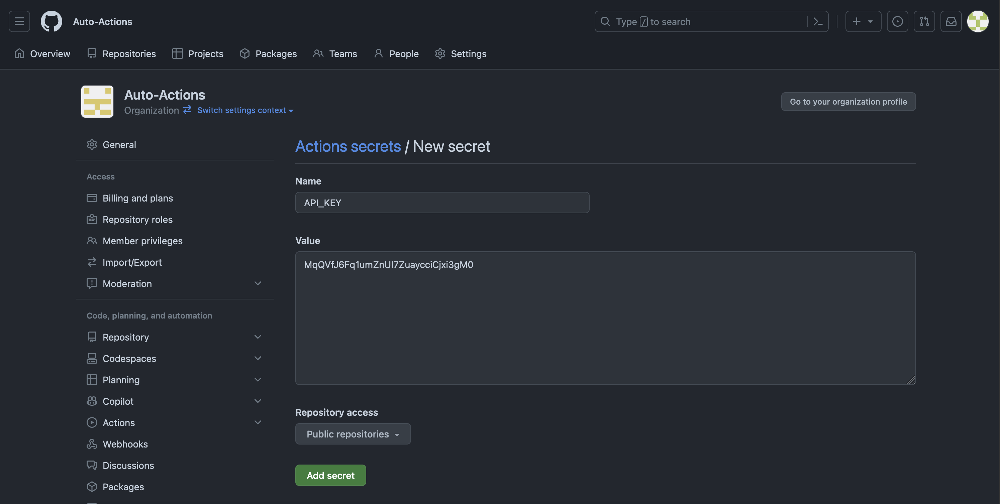

  - Then replace the api key in the action script by:
  
    ```yaml
            customHeaders: '{"Content-Type": "application/json", "KEY": &{{ secret.API_KEY }}}'
    ```

- Next step is to tell the action about your idea by creating a new issue. -->


## Initial issues

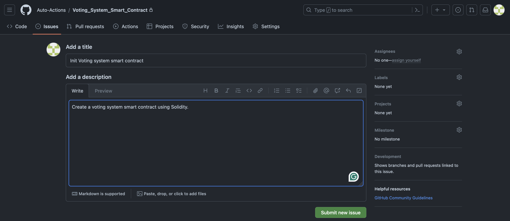

- Then you can switch to Action tab to monitor the development process.

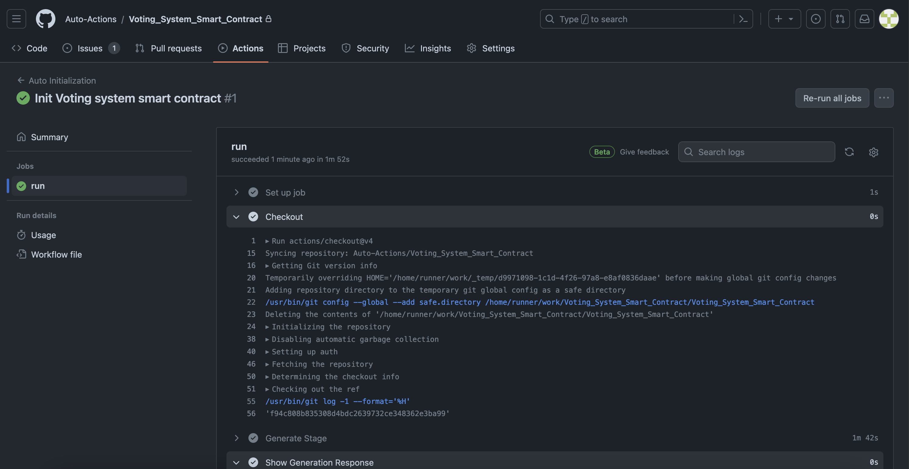

- When the action running finishes, the initial software is already in branch `initial`.

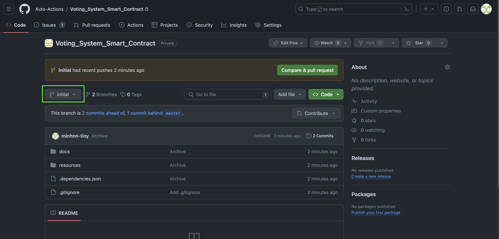


# Demo video

[Youtube](https://youtu.be/m950Aem3dCU)

# Dataset

The dataset for evaluating the framework is available on [Huggingface](https://huggingface.co/datasets/nguyenminh871/software_requirements).


<!-- # TODO

## Service
- [ ] Tracking local repository on server for further update.
- [ ] Serve the feedback/review of developor from action.
- [ ] Agent for particular task such as summarize code, create readme files.
 
## Git Action
- [ ] Trigger action call reprogramming service when developer comment/create issue/merge request.
- [ ] Improve the customization of action. Avoid hardcode, allow developer modify request parameters by environment variables.

 -->
